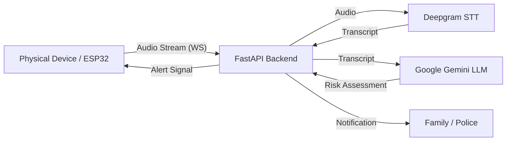

# GrandShield Backend

GrandShield is a protection system designed to safeguard elders from phone scams. This repository contains the backend infrastructure that ingests real-time audio from a physical device (such as a microcontroller or phone tap), processes it for speech-to-text, and analyzes the conversation using Large Language Models (LLMs) to detect potential threats.

## 🛡️ Overview

The system operates by:
1.  **Listening**: Capturing audio from a physical device (e.g., ESP32 with mic/speaker) placed near the elder's phone.
2.  **Transcribing**: Streaming audio to Deepgram for real-time transcription.
3.  **Analyzing**: Feeding transcripts to Google Gemini (LLM) to detect urgency, fear, or requests for sensitive information (bank details).
4.  **Protecting**: Triggering alerts (Siren, LED, SMS to family) if a high-risk scam is detected.

## ✨ Features

- **Real-time Audio Ingestion**: WebSocket endpoint (`/ws/audio`) for low-latency streaming.
- **Live Transcription**: High-accuracy speech-to-text powered by Deepgram.
- **Intelligence Engine**: Context-aware scam detection using Google's Gemini 1.5 Flash.
- **Modular Design**: Clean service-based architecture (Audio, Intelligence, Alerts).
- **Extensible Alerting**: Base alerting system ready for SMS, Email, or hardware GPIO integration.

## 🏗️ Architecture



## 🛠️ Tech Stack

- **Language**: Python 3.9+
- **Framework**: FastAPI
- **Server**: Uvicorn
- **Speech-to-Text**: Deepgram SDK
- **LLM**: Google Generative AI (Gemini)
- **Logging**: Structlog
- **Dependency Management**: Standard `pip` / `uv` / `poetry` implementation provided via `pyproject.toml`.

## 🚀 Getting Started

### Prerequisites

- Python 3.9 or higher
- [Deepgram API Key](https://deepgram.com/)
- [Google Gemini API Key](https://ai.google.dev/)

### Installation

1.  **Clone the repository**
    ```bash
    git clone https://github.com/yourusername/grandshield-backend.git
    cd grandshield-backend
    ```

2.  **Install dependencies**
    Using `pip` (or `uv` for speed):
    ```bash
    pip install -e .
    # OR if using uv
    uv pip install -e .
    ```

    *Dev dependencies:*
    ```bash
    pip install -e .[dev]
    ```

### Configuration

Create a `.env` file in the root directory:

```ini
# .env
ENV=local
DEEPGRAM_API_KEY=your_deepgram_key
DEEPGRAM_PROJECT_KEY=your_deepgram_project_id # Optional depending on usage
GOOGLE_API_KEY=your_gemini_key
```

### Running the Server

Start the application using Uvicorn:

```bash
uvicorn app.main:app --reload --host 0.0.0.0 --port 8000
```

The WebSocket endpoint will be available at `ws://localhost:8000/ws/audio`.

## 📂 Project Structure

```
grandshield-backend/
├── app/
│   ├── api/            # API Routes and endpoints
│   ├── core/           # Core configurations and utilities
│   ├── services/       # Business logic modules
│   │   ├── alerts/     # Notification logic
│   │   ├── audio/      # STT streaming implementation
│   │   └── intelligence/ # LLM analysis logic
│   ├── main.py         # Application entry point
│   └── config.py       # Settings management
├── tests/              # Test suite
└── pyproject.toml      # Project metadata and dependencies
```

## 🤝 Contributing

Contributions are welcome! Please feel free to submit a Pull Request.
